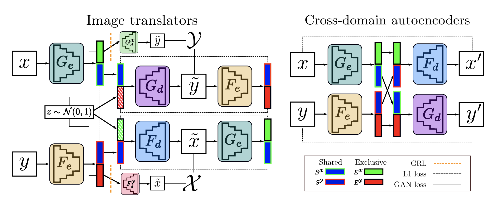
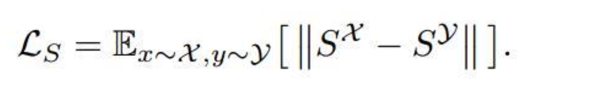
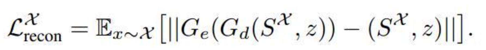
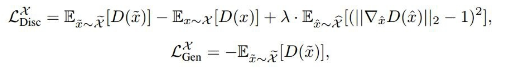
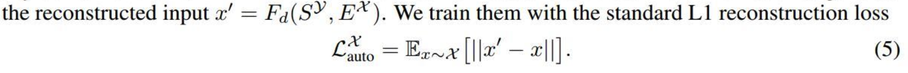

# Image-to-image translation for cross-domain disentanglement

这个项目是以Tensorlayer实现的[Image-to-image translation for cross-domain disentanglement][https://arxiv.org/abs/1805.09730]。

该篇文章发表于2018NIPS上，采用了分解的思想（disentanglement），提出了一种跨域分解（cross-domain disentanglement）的方法，将两个图像域中对应图像中域共有的东西从域独有的东西分离出来。

## 模型

整体框架构图：




用解开表示的方法，将两个域中的图像分解为两部分：（1）域内独有的部分和（2）域间共有的部分。如右边图所示。两张图都是表示5，所有共有的部分是数字5，但5的颜色和背景每个图像域是不同，这就是域独有的部分。

（1）**Exclusive representation.** $E^X$是X域分解后得到的域独有的信息，因此由应$E^X$该无法重构出该图像在Y域对应的图像，为达到这个目的，作者提出了利用Gradient Reversal Layer (GRL)。具体地就是在$G_e$生成$E^X$后面再接一个小解码器（a small decoder）$G_d^X$，希望可以重构出X域对应的Y域照片，采用的训练方式是对抗损失。但我们并不是真的需要由$E^X$可以生成对应的Y域图像，反而更加需要的是生成不了这张对应的图像，所以就有了GRL发挥的作用的地方。GRL反转了反向传播到编码器Ge的梯度符号，仅影响生成域独享特征$E^X$所涉及的那些单元。

（2）**Shared representation. **这篇文章用的是paired的数据，所以它们共享部分的信息应该是相同的（如，都是表示数字5），所以$S^X$和$S^Y$应该是相似的，作者这里直接采用的是L1损失：



但其中的损失会促使模型产生小的信号，作者解决方法是加入小的噪声。

（3）**Reconstructing the latent space.** 这部分就是进行重构，和BicycleGan的思想类似，使加进去的噪声不至于被生成器忽略。同时共享内容部分同样也是要进行重构。



（4）**WGAN-GP loss.** 就是使用WAN-GP作为跨域重构的损失。



（5）**Cross-domain autoencoders.** 这部分很好理解，跨域自编码。由于域共有的部分是域间都是一样的，所以可以进行交换，进行交换的一个好处就是额外地激励把域独有的信息放在$E^X$中，最后得到：



## 要求

```
python 3.7.3
numpy 1.16.0
tensorflow 2.0.0
tensorlayer 2.1.0
```

## 使用方法

要训练模型，运行

```
python run_cross_domain_disen.py  --mode train --output_dir checkpoints/MODEL --input_dir DATA/train/
```

训练完之后要测试，运行

```
python run_cross_domain_disen.py --mode test --output_dir test/MODEL --checkpoint checkpoints/MODEL --input_dir DATA/test/  
```

即可。测试图片放在DATA/test下，结果会放到test/MODEL中。

## 结果


